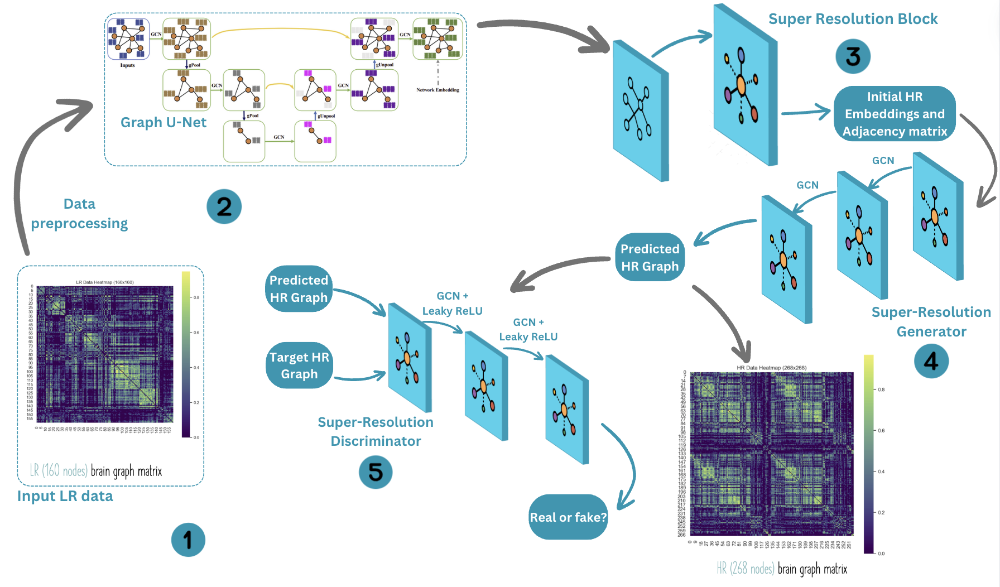
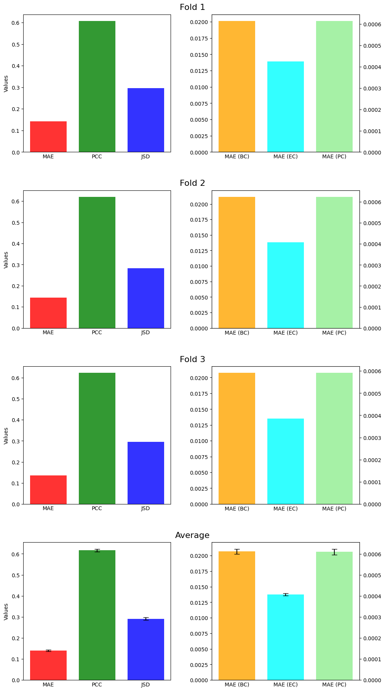

# DGL2024 Brain Graph Super-Resolution Challenge

## Contributors
Great Network Ninjas
- Vlad Coroian, CID: 01854854
- Marcos Fernandez Barreiros, CID: 01497177
- Helena Ferreira Pinto, CID: 01530468
- Siddhant Singh, CID: 01879670
- Yufeng Zhang, CID: 01506456

## Problem Description

Advancements in neuroimaging have provided invaluable insights into the intricate connectivity patterns of the human brain. However, a significant challenge arises from the resolution constraints of the current methods. These limitations restrict our ability to fully capture the detailed connectivity patterns of the brain, at a fine-grained level. 

By leveraging advanced machine learning techniques, specifically generative Graph Neural Networks, we aim to enhance the resolution of brain graphs. Our objective is to generate high-resolution (HR) brain connectivity graphs from their low-resolution (LR) counterparts, overcoming the need for more advanced data collection methods.

The mathematical formulation of the brain graph super-resolution problem centres on learning a mapping function f that can predict a high-resolution (HR) brain graph from a low-resolution (LR) one. Given an LR brain connectivity matrix ($A^{LR}$) the goal is to produce an HR matrix ($\hat{A}^{HR}$) that closely approximates the true HR graph ($A^{HR}$).

$$f : \mathbb{R}^{160 \times 160} \rightarrow \mathbb{R}^{268 \times 268} \\ f(A^{LR}) = \hat{A}^{HR} \approx A^{HR}$$

## Graph2Graph - Methodology

- _Data Preprocessing Steps_: The model begins by loading training and testing data as vectors, which are then converted into matrices. To facilitate node self-updating, self-connections are added, enriching the model's input data representation.

- _DropGNN and Data Augmentation_: To enhance model generalization, a technique involving random node drops during training is employed. This approach exposes the model to various versions of the same graph, ensuring robustness and adaptability.

- _Graph U-Autoencoder_: This component is crucial for translating the topological relationships between nodes in low-resolution graphs into meaningful node features, compensating for the absence of explicit node features in the input data.

- _Graph Super-Resolution Layer_: Building upon the extracted node features and the low-resolution adjacency matrix, this layer constructs a high-resolution graph representation, effectively increasing the detail and resolution of the graph structure.

- _Generative Adversarial Network (GAN)_: A GAN variant is utilized to refine the initial high-resolution predictions made by the Super-Resolution block, employing graph convolutional layers to generate and evaluate high-resolution brain graphs.

    - _Super-Resolution Generator_: This component includes two graph convolutional layers that further propagate and refine the generated high-resolution connections, resulting in enriched node embeddings and a detailed high-resolution adjacency matrix.

    - _Super-Resolution Discriminator_: A key innovation in the Graph2Graph model is the super-resolution discriminator, which leverages two GCN layers to discern the authenticity of the generated high-resolution node embeddings, distinguishing them from those derived from prior distributions.

## Used External Libraries

- PyTorch Geometric: `pip install torch-geometric`

## Results

## References

1. M. Isallari and I. Rekik, 'Brain Graph Super-Resolution Using Adversarial Graph Neural Network with Application to Functional Brain Connectivity', Medical Image Analysis, 71:102084, 2021.
2. M. Isallari and I. Rekik, 'GSR-Net: Graph super-resolution network for predicting high-resolution from low-resolution functional brain connectomes,' in Machine Learning in Medical Imaging: 11th International Workshop, MLMI 2020, Held in Conjunction with MICCAI 2020, Lima, Peru, October 4, 2020, Proceedings 11, pp. 139--149, Springer, 2020.
3. H. Gao and S. Ji, 'Graph U-Nets,' in International Conference on Machine Learning, pp. 2083--2092, 2019, PMLR.
4. P.A. Papp and K. Martinkus and L. Faber and R. Wattenhofer, 'DropGNN: Random Dropouts Increase the Expressiveness of Graph Neural Networks', 35th Conference on Neural Information Processing Systems, 2021

## How to run the code

Most of the code is in the juptyer notebook. The notebook relies only on the file MatrixVectorizer.py and the data files (which should be placed in the data/ folder). The notebook can be run from top to bottom to train the model and generate the predictions. The notebook also contains the code to generate the submission file.